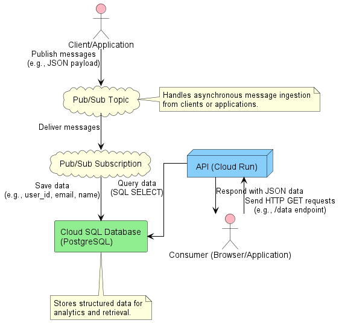

# Candidate Information

Name: Felipe Silva  
Position Applied For: DevOps Engineer at LATAM Airlines  
Contact: felipe.silva@biomedica.udec.cl

---

# Challenge DevSecOps/SRE

## Table of Contents
1. [Part 1: Infrastructure and IaC](#part-1-infrastructure-and-iac)
- 1. [Infrastructure Design](#11-infrastructure-design)
   - 1. [Data Ingestion](#111-data-ingestion)
   - 2. [Data Storage](#112-data-storage)
   - 3. [Data Exposure](#113-data-exposure)
- 2. [Infrastructure Deployment with Terraform](#12-infrastructure-deployment-with-terraform)
   - 1. [Terraform Resources](#121-terraform-resources)
   - 2. [IAM Roles and Permissions](#122-iam-roles-and-permissions)
   - 3. [Outputs](#123-outputs)
- 3. [Validation](#13-validation)
2. [Part 2: Applications and CI/CD Workflow](#part-2-applications-and-cicd-workflow)
- 1. [HTTP API](#21-http-api)
- 2. [CI/CD Pipeline](#22-cicd-pipeline)
- 3. [Pub/Sub Listener and Database Integration](#23-pubsub-listener-and-database-integration)
   - 1. [Google Cloud Pub/Sub](#231-google-cloud-pubsub)
   - 2. [Listener Script](#232-listener-script)
   - 3. [Database Integration](#233-database-integration)
   - 4. [Testing](#234-testing)
- 4. [Architecture Diagram](#24-architecture-diagram)
3. [Part 3: Integration Tests and Critical Quality Points](#part-3-integration-tests-and-critical-quality-points)
- 1. [Continuous Integration and Continuous Deployment (CI/CD)](#31-continuous-integration-and-continuous-deployment-cicd)
   - 1. [Continuous Integration (CI)](#311-continuous-integration-ci)
   - 2. [Continuous Deployment (CD)](#312-continuous-deployment-cd)
- 2. [Additional Integration Tests](#32-additional-integration-tests)
- 3. [Infrastructure Observability](#33-infrastructure-observability)
- 4. [Handling System Failures](#34-handling-system-failures)
4. [Part 4: Metrics and Monitoring](#part-4-metrics-and-monitoring)
- 1. [Critical Metrics](#41-critical-metrics)
- 2. [Visualization Tool](#42-visualization-tool)
- 3. [High-Level Implementation of a Cloud-Based Monitoring Tool](#43-high-level-implementation-of-a-cloud-based-monitoring-tool)
- 4. [Optimization Opportunities](#44-optimization-opportunities)
- 5. [Challenges and Limitations in Observability Without Proper Scalability](#45-challenges-and-limitations-in-observability-without-proper-scalability)
5. [Part 5: Alerts and SRE](#part-5-alerts-and-sre)
- 1. [Alert Rules and Thresholds](#51-alert-rules-and-thresholds)
- 2. [SLIs and SLOs Definition](#52-slis-and-slos-definition)

---

## Part 1: Infrastructure and IaC

This section outlines the implementation of the cloud-based system for ingesting, storing, and exposing data as required in the challenge.

### **1.1 Infrastructure Design**
The following components were identified and implemented:

#### **1.1.1 Data Ingestion**
A Pub/Sub topic named `data-ingestion-topic` was created to handle data ingestion. Note that this implementation does not use Google’s managed Pub/Sub service but follows the Pub/Sub pattern.

#### **1.1.2 Data Storage**
A PostgreSQL instance was provisioned using Google Cloud SQL, configured with:
- PostgreSQL version 13.
- UTF8 encoding and collation set to `en_US.UTF8`.
- An admin user with a password for database management.

#### **1.1.3 Data Exposure**
An HTTP endpoint was deployed using Google Cloud Run to expose stored data. The endpoint is publicly accessible and serves as an interface for third-party consumers.

---

### **1.2 Infrastructure Deployment with Terraform**

Terraform was used to provision and manage the infrastructure. Below are the main resources and configurations:

#### **1.2.1 Terraform Resources**
- **Pub/Sub Topic**: Configured for data ingestion under the name `data-ingestion-topic`.
- **Cloud SQL Instance**:
  - Provisioned a PostgreSQL database with optimized settings for analytics.
  - Connection credentials were securely managed using Terraform outputs.
- **Cloud Run Service**:
  - A containerized API was deployed using an image hosted on Google Container Registry (GCR).
  - Configured with a 3600-second timeout due to limited internet connectivity in the rural area where I am located.

#### **1.2.2 IAM Roles and Permissions**
To enable seamless operation, the following roles were assigned:
- `roles/cloudsql.client`: For database access from the Cloud Run service.
- `roles/pubsub.publisher`: To allow publishing to the Pub/Sub topic.

#### **1.2.3 Outputs**
Terraform was configured to output:
- **`cloud_run_url`**: The public URL of the deployed Cloud Run service.
- **`db_connection_name`**: The connection string for the Cloud SQL database.

---

### **1.3 Validation**

The setup was validated by deploying a simple Flask-based API. The API responds with `Hello, World!` at the root endpoint and was confirmed operational by accessing the Cloud Run public URL.

- **Application Code**: The API was built using Flask and dynamically reads the `PORT` environment variable for compatibility with Cloud Run.
- **Dockerization**:
  - A lightweight Python image (`python:3.9-slim`) was used as the base.
  - Dependencies were installed via `requirements.txt`.
  - Gunicorn was used as the production-ready application server.
- **Deployment Steps**:
  1. Build and push the Docker image to Google Container Registry (GCR).
  2. Apply Terraform changes to provision the infrastructure.
  3. Use the `gcloud` CLI to make the Cloud Run service publicly accessible.

---

## Part 2: Applications and CI/CD Workflow

### **2.1 HTTP API**

An HTTP API was created to read data from a database and expose it via a GET request.

#### **Steps Taken:**
1. Set up a new Cloud SQL instance named `postgres-instance` as the production-ready database for this project.
   - Configured the database and ensured proper IP authorization for connectivity.
   - Used the `admin` user to create the `challenge_db` database, which replaced the initial setup for improved testing and final integration.
2. Connected to the database via `gcloud sql connect` and created a new table named `test_table` for data handling during testing.
   - The table contains the following columns:
     - `id`: Primary key, auto-incrementing.
     - `column1`: VARCHAR(50).
     - `column2`: VARCHAR(255).
3. Inserted test data into the `test_table`.

#### **Table Initialization Script:**
```sql
CREATE TABLE test_table (
  id SERIAL PRIMARY KEY,
  column1 VARCHAR(50) NOT NULL,
  column2 VARCHAR(255) NOT NULL
);

INSERT INTO test_table (column1, column2) VALUES
('Test 1', 'This is the first test row'),
('Test 2', 'This is the second test row');
```

### **API Enhancements**

1. Modified the `app.py` file to include a new `/data` endpoint.
   - The endpoint retrieves and returns all rows from `test_table` in JSON format.
2. Updated the `DATABASE` configuration in `app.py` to connect via Cloud SQL Socket:
   ```python
   "host": "/cloudsql/devsecops-sre-challenge:us-central1:postgres-instance",
   "port": 5432,
   "database": "challenge_db",
   "user": "admin",
   "password": "password123"

---

### **2.2 CI/CD Pipeline**

The API was deployed to the cloud using a CI/CD pipeline for automated deployment.

#### **Implementation**
1. **Code Build**:
   - Each update triggers the build process where a new Docker image is created for the API:
     ```bash
     docker build -t flask-api .
     ```

2. **Image Tagging and Push**:
   - The Docker image is tagged and pushed to Google Container Registry (GCR):
     ```bash
     docker tag flask-api gcr.io/devsecops-sre-challenge/flask-api:latest
     docker push gcr.io/devsecops-sre-challenge/flask-api:latest
     ```

3. **Automated Deployment**:
   - The pipeline uses `gcloud run deploy` to update the Cloud Run service with the latest image:
     ```bash
     gcloud run deploy flask-api \
       --image gcr.io/devsecops-sre-challenge/flask-api:latest \
       --platform managed \
       --region us-central1 \
       --allow-unauthenticated \
       --add-cloudsql-instances devsecops-sre-challenge:us-central1:postgres-instance
     ```

#### **Validation**
Accessed the `/data` endpoint, which returned the following response:
```json
{
  "data": [
    {"id": 1, "column1": "Test 1", "column2": "This is the first test row"},
    {"id": 2, "column1": "Test 2", "column2": "This is the second test row"}
  ]
}
```

---

### **2.3 Pub/Sub Listener and Database Integration**

A subscription was added to the Pub/Sub system with logic to process received messages and store them in a PostgreSQL database, ensuring messages published to the topic are saved in the database.

#### **Implementation**

#### **2.3.1 Google Cloud Pub/Sub**
   - A Pub/Sub topic (`ingestion-topic`) was created to handle message publishing.
   - A subscription (`ingestion-topic-sub`) was created to listen for messages on the topic.

#### **2.3.2 Listener Script**
   - A Python script (`pubsub_listener.py`) was implemented with the following logic:
     - Listen for messages from the `ingestion-topic-sub` subscription.
     - Validate the received data.
     - Insert the data into a PostgreSQL database table (`users`).

#### **2.3.3 Database Integration**
   - A new `users` table was created in the PostgreSQL database:
     ```sql
     CREATE TABLE users (
         user_id SERIAL PRIMARY KEY,
         email VARCHAR(255) NOT NULL,
         name VARCHAR(255) NOT NULL
     );
     ```
   - The table was populated with sample data for testing purposes:
     ```sql
     INSERT INTO users (email, name) VALUES
     ('john.doe@example.com', 'John Doe'),
     ('jane.smith@example.com', 'Jane Smith'),
     ('alice.johnson@example.com', 'Alice Johnson'),
     ('bob.miller@example.com', 'Bob Miller'),
     ('charlie.brown@example.com', 'Charlie Brown'),
     ('diana.prince@example.com', 'Diana Prince');
     ```

#### **2.3.4 Testing**
   - Messages were published to the Pub/Sub topic for validation:
     ```bash
     gcloud pubsub topics publish ingestion-topic --message '{"user_id": 7, "email": "linda.williams@example.com", "name": "Linda Williams"}'
     ```
   - The listener script processed the message and inserted it into the `users` table.
   - Data was verified in the database using:
     ```sql
     SELECT * FROM users;
     ```

---

### **2.4 Architecture Diagram**

An architecture diagram was included to illustrate the end-to-end process of data ingestion, storage, and exposure through the HTTP API.

#### **Diagram Overview**
The diagram shows three primary stages:

1. **Data Ingestion:**
   - Clients or applications publish messages in JSON format to the **Pub/Sub Topic**.
   - The **Pub/Sub Subscription** delivers the messages to the system for processing.

2. **Data Storage:**
   - Processed messages are stored in the **Cloud SQL Database** (PostgreSQL).

3. **Data Exposure:**
   - The **API**, hosted on **Cloud Run**, retrieves data from the database and exposes it via a GET endpoint.
   - External consumers (e.g., browsers or applications) can send HTTP GET requests to retrieve the data in JSON format.

#### **Component Roles**
- **Pub/Sub Topic and Subscription:** Handle message ingestion and ensure reliable delivery.
- **Cloud SQL Database:** Stores structured data for downstream processing and querying.
- **API (Cloud Run):** Serves as the interface for external consumers to access stored data.
- **Client/Application:** External entities interacting with the system to publish or consume data.

#### **Diagram**


This diagram provides a clear overview of how data flows through the system, from ingestion to storage and exposure.

---

## Part 3: Integration Tests and Critical Quality Points

### **3.1 Continuous Integration and Continuous Deployment (CI/CD)**

The CI/CD pipeline ensures that every update to the codebase is thoroughly tested and deployed seamlessly. The implementation details are as follows:

#### **3.1.1 Continuous Integration (CI)**
- A GitHub Actions workflow (`ci.yml`) was created to maintain code quality by running automated tests whenever changes are:
  1. Pushed to the `main` branch.
  2. Submitted via pull requests targeting the `main` branch.
- **Testing Framework**: The pipeline uses the `pytest` framework to validate the functionality of the application.
- The CI pipeline verifies:
  1. The correctness of the API endpoints.
  2. Integration with the database.
- Only changes that pass all tests are merged into the `main` branch, ensuring the integrity of the codebase.

#### **3.1.2 Continuous Deployment (CD)**
- A separate GitHub Actions workflow (`cd.yml`) is triggered on every push to the `main` branch.
- **Key Steps**:
  1. **Docker Build**:
     - The application is containerized using a `Dockerfile` located in the `/api` directory.
     - The Docker image is tagged and pushed to Google Container Registry (GCR).
  2. **Deployment**:
     - The latest image is deployed to Google Cloud Run using `gcloud run deploy`.
     - The API is configured to securely connect to the Cloud SQL database for persistent storage.
  3. **Authentication**:
     - The workflow uses a Google service account key, securely stored as a GitHub secret, for authentication.

#### **Benefits of the CI/CD Pipeline**
- Automates testing, building, and deployment processes.
- Ensures code reliability and quality before deployment.
- Speeds up the delivery process while reducing the risk of production issues.

---

### **3.2 Additional Integration Tests**

To ensure the robustness and quality of the architecture, the following integration tests are proposed to validate key aspects of the system.

#### **Integration Test Plan**
1. **Invalid Message Handling**: Verify that invalid Pub/Sub messages do not affect the system.
   - **Scenario**: Publish a message missing required fields (e.g., `user_id`).
   - **Expected Result**: 
     - The message is logged as an error.
     - The invalid message is not stored in the database.

2. **Database Connectivity**: Test system behavior during database downtime.
   - **Scenario**: Disconnect the Cloud SQL Proxy and send API requests.
   - **Expected Result**: 
     - The API returns a `500 Internal Server Error` response.
     - Database consistency is maintained when connectivity is restored.

3. **Pub/Sub to Database Flow**: Ensure that valid messages published to Pub/Sub are properly stored in the database.
   - **Scenario**: Publish a batch of valid messages and query the database.
   - **Expected Result**: 
     - All messages are correctly inserted into the `users` table.

4. **High Load API Performance**: Test the API’s scalability under heavy load.
   - **Scenario**: Send 1,000 concurrent requests to the `/data` endpoint.
   - **Expected Result**: 
     - The API responds with <200ms latency under load.
     - No errors or downtime occur.

5. **Data Consistency**: Verify that API responses match database contents.
   - **Scenario**: Insert test records into the database and call the `/data` endpoint.
   - **Expected Result**: 
     - The API response matches the database records exactly.

#### **Execution Plan**
- These tests will be automated using `pytest` and included in the CI pipeline.
- Mocking tools (e.g., `unittest.mock`) will simulate Pub/Sub and database dependencies.
- Load testing tools like `Locust` or `JMeter` will be used for performance validation.

---

### **3.3 Infrastructure Observability**

Monitoring and observability are essential for maintaining system health. The following strategies ensure effective infrastructure monitoring:

#### **Monitoring and Logging Plan**

1. **Pub/Sub Monitoring**
   - Track message publishing, delivery rates, and failures with Google Cloud Monitoring.
   - Set alerts for undelivered messages or high failure rates.

2. **Cloud Run Observability**
   - Log API requests and errors with **Cloud Logging**.
   - Monitor CPU usage, memory, request rates, and response times using **Cloud Monitoring** dashboards.

3. **Cloud SQL Monitoring**
   - Track query performance, execution times, and connection utilization.
   - Set alerts for high query latency or low storage availability.

4. **End-to-End Monitoring**
   - Use **Google Cloud Trace** to visualize request flows from Pub/Sub to the database and API responses.

#### **Implementation**
- Centralized monitoring with **Cloud Operations Suite**.
- Alerts notify the team via email for anomalies.

---

### **3.4 Handling System Failures**

To ensure system resilience, the following strategies address potential failures:

#### **Failure Scenarios and Proposed Solutions**

1. **Pub/Sub Message Delivery Failures**
   - **Cause**: Invalid messages or delivery errors.
   - **Solution**: Log and skip invalid messages; enable retries for transient errors.

2. **Database Downtime**
   - **Cause**: Cloud SQL maintenance or crashes.
   - **Solution**: Return `503 Service Unavailable` during downtime; use transactions for data integrity.

3. **API Overload**
   - **Cause**: Excessive request volumes.
   - **Solution**: Enable Cloud Run autoscaling and implement rate-limiting for non-critical requests.

4. **Cloud Run Deployment Failures**
   - **Cause**: Invalid Docker images or misconfigurations.
   - **Solution**: Add CI/CD build validation steps and implement rollback mechanisms for stable deployments.

---

## Part 4: Metrics and Monitoring

### **4.1 Critical Metrics**

To monitor the health and performance of the system, the following metrics are proposed:

1. **Database Query Latency**:
   - Measures the time taken to execute SQL queries.
   - Helps identify performance bottlenecks in the database layer.

2. **Pub/Sub Message Processing Latency**:
   - Tracks the time taken from when a message is published to Pub/Sub until it is processed and stored in the database.
   - Ensures real-time processing and highlights delays.

3. **API Response Time**:
   - Measures the duration between receiving a client request and sending back a response.
   - Helps ensure the API meets performance expectations.

---

### **4.2 Visualization Tool**

**Proposed Tool**: **Google Cloud Monitoring and Cloud Logging**

#### **Metrics to Display**
- Real-time dashboards showing:
  1. **Pub/Sub Metrics**:
     - Number of messages published and processed.
     - Message processing latency.
  2. **Database Metrics**:
     - Query execution time.
     - Number of active connections.
  3. **API Metrics**:
     - Response time.
     - HTTP request counts (successful vs. failed).
- Historical trends for analyzing system behavior over time.

#### **Benefits**
- Provides a centralized view of system health.
- Enables quick identification of performance bottlenecks.
- Aids strategic decisions by observing long-term trends.

---

### **4.3 High-Level Implementation of a Cloud-Based Monitoring Tool**

#### **Architecture Overview**
1. **Metric Collection**:
   - Deploy agents (e.g., Google Cloud Ops Agent) to collect system metrics like CPU, memory, and logs.
   - Instrument applications to track API latency, database performance, and Pub/Sub metrics.

2. **Centralized Aggregation**:
   - Use Google Cloud Monitoring to securely aggregate metrics and logs across systems.

3. **Visualization and Alerting**:
   - Build dashboards with Google Cloud Monitoring or Grafana for metrics like response times and message throughput.
   - Configure alerts for key thresholds (e.g., high error rates, CPU spikes) via email or Slack.

#### **Deployment Process**
1. Use Terraform or similar IaC tools to automate deployment of monitoring agents and configurations.
2. Ensure scalability with managed services like Google Cloud Monitoring for seamless growth as the system expands.

This approach provides scalable and reliable monitoring for efficient issue detection and resolution.

---

### **4.4 Optimization Opportunities**

#### **Scaling the Solution to 50 Systems**

If scaled to 50 systems, visualization must adapt for clarity and usability:

1. **Enhanced Dashboards**:
   - Aggregate data across all systems with filters for individual analysis.
   - Use color-coded alerts for anomalies (e.g., red for critical issues).

2. **Centralized Monitoring**:
   - Create a unified view of metrics like Pub/Sub throughput, database usage, and API performance across all systems.

3. **Key Metrics and Visualizations**:
   - Introduce heatmaps for high-level metrics (e.g., API latency) and trend graphs for performance changes over time.
   - Use correlation graphs to link metrics like API errors with database performance.

4. **Additional Insights**:
   - Compare system performance to optimize outliers.
   - Analyze resource usage trends for capacity planning.
   - Leverage predictive analytics to foresee failures or scaling needs.

Scaling enables a comprehensive view, proactive management, and optimized performance across systems.

---

### **4.5 Challenges and Limitations in Observability Without Proper Scalability**

Failing to address scalability in observability can lead to these challenges:

1. **Data Overload**: Exponential growth in metrics can slow queries or cause data loss without scalable storage and processing.
2. **Lack of Centralized View**: Non-aggregated tools create silos, complicating cross-system diagnostics.
3. **Performance Bottlenecks**: Processing large telemetry data can delay alerts and impact incident response times.
4. **Increased Cost**: High data volumes without optimization raise operational costs, forcing reduced retention or granularity.
5. **Inaccurate Alerts**: Delayed or missing data can result in false positives or missed critical alerts.
6. **Limited Insights**: Poor scalability hinders correlation of metrics, logs, and traces, complicating root cause analysis.
7. **Security Risks**: Inconsistent configurations across systems increase risks of missed security events and non-compliance.

#### **Mitigation Strategies**
- Use **cloud-native tools** like Google Cloud Monitoring for dynamic scaling.
- Apply **data aggregation and sampling** to reduce volumes while retaining key insights.
- Ensure **role-based access controls (RBAC)** for consistent configurations.
- Regularly update **alerting policies** to avoid gaps or noise.
- Utilize **machine learning** for accurate, scalable anomaly detection.

Proactively addressing these issues ensures a scalable and reliable observability framework.

---

## Part 5: Alerts and SRE

### **5.1 Alert Rules and Thresholds**

Proposed alert rules ensure timely detection and resolution of system issues:

1. **CPU Usage**: Alert if usage >85% for 5+ minutes; investigate bottlenecks or scale horizontally.
2. **Memory Usage**: Alert if usage >90% for 5+ minutes or spikes >95%; optimize or allocate more memory.
3. **Database Latency**: Alert if query latency >200ms for 10+ minutes; optimize queries or scale the database.
4. **Error Rate**: Alert if errors exceed 5% over 10 minutes; debug logs and resolve issues.
5. **API Response Time**: Alert if 95th percentile response time >1 second for 5+ minutes; analyze traces for bottlenecks.
6. **Disk Usage**: Alert if usage >80% or write speed drops; expand storage or optimize operations.
7. **Pub/Sub Backlog**: Alert if backlog >1,000 messages for 10+ minutes; scale listeners or troubleshoot delays.
8. **Service Availability**: Alert if service is down for 1+ minute or error rate >2%; investigate and redeploy if needed.

#### **Alert Severity Levels**
- **Critical**: Issues affecting availability or user experience (e.g., service downtime, high error rate).
- **Warning**: Performance degradation requiring attention (e.g., high CPU or memory usage).

These thresholds enable proactive issue resolution, ensuring system reliability and a better user experience.

---

### **5.2 SLIs and SLOs Definition**

To monitor system reliability and performance, the following SLIs and SLOs are defined:

#### **SLI 1: Availability**
- **Definition**: Percentage of successful requests (HTTP 200–299).
- **SLO**: 99.9% success rate over 30 days.
- **Reasoning**: Reflects user access reliability.

#### **SLI 2: Latency**
- **Definition**: API response time (95th percentile).
- **SLO**: Below 500ms for 95% of requests over 30 days.
- **Reasoning**: Ensures fast, consistent user experiences.

#### **SLI 3: Error Rate**
- **Definition**: Failed requests as a percentage of total requests.
- **SLO**: Below 1% over 7 days.
- **Reasoning**: Indicates system stability.

#### **SLI 4: Pub/Sub Latency**
- **Definition**: Time to process messages from Pub/Sub to the database.
- **SLO**: 95% of messages processed within 2 seconds over 7 days.
- **Reasoning**: Ensures pipeline efficiency.

#### **SLI 5: Database Query Latency**
- **Definition**: Time to execute database queries (95th percentile).
- **SLO**: Below 300ms for 95% of queries over 7 days.
- **Reasoning**: Critical for fast API responses.

By focusing on availability, latency, error rate, and key infrastructure metrics, these SLIs/SLOs ensure system reliability, user satisfaction, and operational efficiency.
